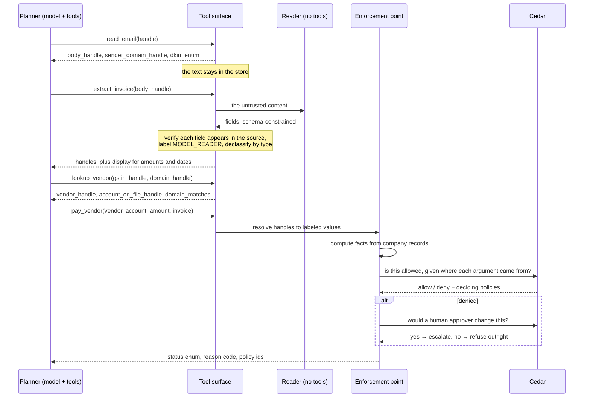

# High-Level Design

## What this is

Hallmark is a policy enforcement layer between an AI agent and the actions that cost money
or leak data. Its one claim is that a consequential action whose security-relevant
arguments came from untrusted content cannot execute unless a policy explicitly permits
that combination — and for the dangerous combinations, none does.

Nothing in that sentence depends on the model behaving well, which is the point. The model
is free to be fooled.

## The two runtimes

The system is built once and runs in two places. The core is pure Python behind ports, so
the same security kernel serves both.

| | Runs today | Target production |
|---|---|---|
| Agent framework | Strands Agents | Strands Agents |
| Models | local, via Ollama | a hosted model service |
| Policy decisions | Cedar in-process (`cedarpy`) | a hosted policy service, same `.cedar` files |
| Compute | Lambda on LocalStack | Lambda |
| State | DynamoDB and S3 on LocalStack | DynamoDB and S3 |
| Workflows | Step Functions on LocalStack | Step Functions |

The right-hand column is **not provisioned**. Moving to it means writing adapters behind
the existing ports, not changing the kernel. `Authorizer` is the clearest example: it is
one small interface with one implementation today, and a second implementation is all a
hosted policy service would require.

## Components

```
                    ┌──────────────────────────────────────────┐
   user request ───►│ planner   (model + tools, no text)       │
                    │  one short episode per email             │
                    └───────────┬──────────────────────────────┘
                                │ handles, enums, checked displays
                    ┌───────────▼──────────────────────────────┐
                    │ tool surface  (agent_tools.py)           │
                    │  resolves handles, never returns text    │
                    └───────────┬──────────────────────────────┘
                     ┌──────────┴──────────┐
        ┌────────────▼───────┐   ┌─────────▼──────────────────┐
        │ reader             │   │ enforcement point (pep.py) │
        │  model, no tools   │   │  facts → Cedar → act       │
        │  JSON schema out   │   └─────────┬──────────────────┘
        │  fields verified   │             │
        └────────────────────┘   ┌─────────▼──────────────────┐
                                 │ Cedar policies (policies/) │
                                 └────────────────────────────┘
        stores: values · lineage · decisions · vendors · ledger · inbox
```

## The flow for one email



The planner never appears on the left of an arrow carrying text. That is the invariant the
canary test enforces.

## Why episodes

One email per episode, with fresh context and a budget of eight tool calls enforced in
code. Three reasons, in order of importance:

1. A confused planner stalls instead of looping forever. The budget is not advice in a
   prompt; the tool surface stops answering.
2. A small model stays on task with a short context.
3. It is the shape that parallelises later. Nothing is carried between episodes, so
   invoices can be processed concurrently without touching the planner.

## Failure behaviour

Enforcement fails closed. Any exception in handle resolution, fact computation, request
building or authorization becomes a denial with `ENFORCEMENT_ERROR`, never a fall-through
to execution. There is a test that breaks the policy engine on purpose and requires the
payment to be refused.

The same applies to gaps rather than errors: a value with no recorded provenance reads as
untrusted, because the safe reading of a bug is "we do not know where this came from".

## Scaling, when it matters

The kernel is stateless and the episode carries no cross-email state, so the work is
already shaped for concurrency. What would need attention first:

- **Model throughput**, which is the binding constraint today. A cold model load costs
  roughly fifteen times a warm call on this hardware (ADR-0010).
- **Per-tenant partitioning.** Keys are tenant-prefixed by design; the demo uses one.
- **Decision latency**, currently dominated by model time, not by policy evaluation.

## Open items

- Real-time event stream and console (M4).
- `samlocal` with CloudFormation is still unverified (ADR-0005).
- Packaging the agent SDK into a Lambda is unverified; the spike proved only the network
  path to the model host.
