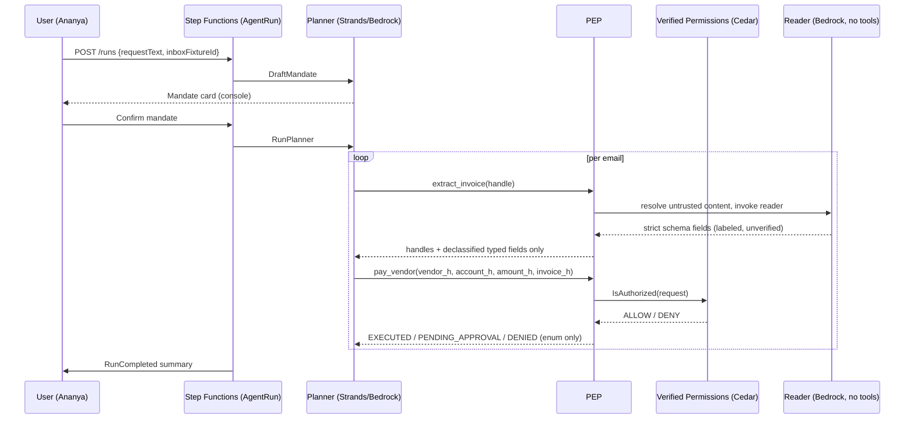

# High-Level Design

First draft — kept current as milestones land (§0.2.1.14).

## Context

Hallmark is a provenance-aware policy enforcement layer sitting between an AI agent
(Strands planner on Bedrock) and the consequential tools it can call (paying a vendor,
sending an email). See `CLAUDE.md` §1–§4 for the full problem statement and mechanisms.

## Component diagram (target, §12.1 of CLAUDE.md)

See `CLAUDE.md` §12.1 for the full AWS architecture diagram (Console → API Gateway →
Step Functions → planner runtime Lambda → PEP → Verified Permissions, backed by
DynamoDB/S3/EventBridge/Cognito). Reproduced and kept in sync in `docs/architecture.md`
once the stack exists.

## Key flow: hero run (sequence, Mermaid)

## Scaling and failure analysis (initial)

- Stateless Lambdas; all state in DynamoDB/S3/Step Functions (§0.2.1.2).
- Long-running planner work happens inside a Step Functions-orchestrated Lambda, not an
  API request (§0.2.1.3). Clients follow progress via WebSocket events.
- Every external call (Bedrock, Verified Permissions, DynamoDB) needs a timeout and
  bounded retries; enforcement fails closed on any exception (§9.5, §0.2.1.7).
- Multi-tenant partition keys from day one (`TENANT#<tenantId>#...`), single tenant
  (`kestrel`) used in the demo (§0.2.1.5).

## Open items

- Region and model IDs pending AWS account + Bedrock access confirmation (ADR-0003).
- Full context/deployment diagrams to be added once the SAM stack is deployed (M3).
